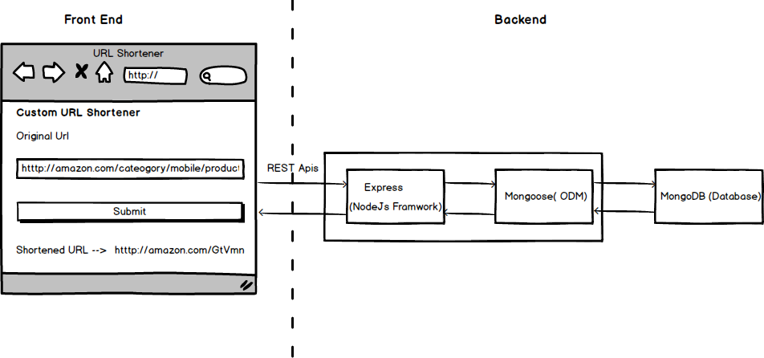

<h1 align="center">
  URL-Shortner
</h1>

<h4 align="center">Creating custom URL shortener With Nodejs</h4>
<div align="center">
  <sub>Built with ❤︎ </sub>
</div>

</br>
Building a custom URL shortening service like goo.gl or bitly using ExpressJs and Mongodb

With ❤︎ and Inspiration from Muhsin.K, the original source where all ideas are built on
Muhsin.K Blog: [Creating custom URL shortener with Nodejs](https://codeburst.io/creating-custom-url-shortener-with-nodejs-de10bbbb89c7)
Muhsin.K Repo: [Creating custom URL shortener with Nodejs](https://github.com/muhzi4u/URL-Shortner)

## Blog

## Architecture



## Technologies

- ### Back end

  - [Express](https://expressjs.com/)- Nodejs framwork for building the REST Apis
  - [Mongodb](http://mongodb.com/)- Document oriented NoSQL database
  - [Mongoose](https://http://mongoosejs.com)- MongoDB object modeling tool
  - [Redis](https://redis.io/)- App in-memory caching
  - [Short-id](https://github.com/dylang/shortid)- Short id generator
  - [Valid-url](https://github.com/ogt/valid-url)- URI validation functions
  - [Nginx](https://www.nginx.com)- Nginx is event-based and asynchronous web server.

## Getting Started

#### Clone the project

```sh
# clone it
git clone https://github.com/josemak25/url-shortener.git
cd url-shortener
# Make it your own
rm -rf .git && git init
```

#### Run back-end

```
# Move to client folder
cd client/
# Install dependencies using yarn
yarn install

# OR Install dependencies using yarn
npm install

```

## License

MIT
